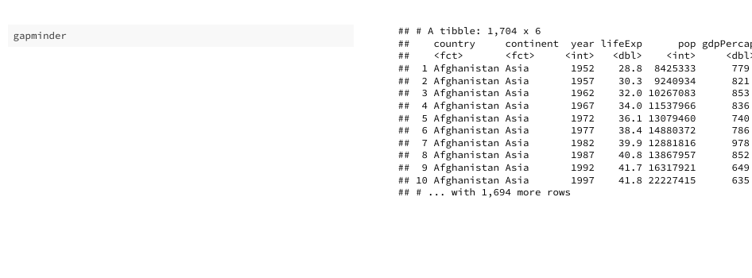

# tidyverse-gifs

Provides an example of how to create a gif using:

`flair` --> `xaringan` + `pagedown` --> `magick`

**Steps:**

1. Create slides (e.g. "xaringan-slides-example.Rmd")
2. Render slides into a gif (e.g. "render-gif.R")

**Example of resulting output:**

**Improved method:**

I posted an easier approach (largely superseding this one) that uses:

`flipbookr` --> `pagedown` --> `magick` to create types of gifs in a way that does not require nearly as much copying and pasting of code [brshallo/flipbookr-gifs-examples](https://github.com/brshallo/flipbookr-gifs-examples).

